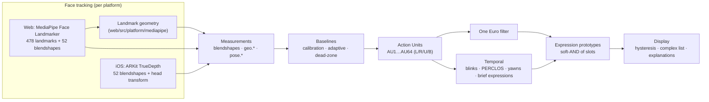

# Architecture



Everything from **Measurements** onwards is platform-independent and driven by one
data file, [`model/emotion-model.json`](../model/emotion-model.json). Two engines
interpret it:

- `web/src/engine/` — TypeScript (web app, tests, analysis scripts)
- `ios/EmotionEngine/` — Swift package (native iOS app), a line-for-line port

Parity is enforced: `web/scripts/make-golden.ts` runs the TypeScript engine over
`model/fixtures/sequences.json` and writes `model/fixtures/golden.json`. The Swift
tests replay the same inputs and must reproduce every score, AU, label and event
(tolerance 1e-5).

## 1. Measurements

Each platform adapter produces a flat `Record<string, number>` per frame:

- **Blendshapes** by ARKit name (`mouthSmileLeft`, `browInnerUp`, …). The iOS app
  converts ARKit's raw keys (`mouthSmile_L`) to this form.
- **Geometry** (web only), `geo.*`: brow heights over the eye corners, eye aperture,
  lower-lid height, malar cheek height, nostril-wing height, lip-corner height
  relative to the lip midline, lip-corner spread, brow gap, lip gap, jaw drop and
  lip thickness. They are measured in a head-aligned frame built from rigid
  landmarks and expressed in inter-ocular distances, so they don't change with head
  rotation or distance from the camera.
- **Texture** (web only), `tex.*`: forehead wrinkles (`tex.foreheadLines`, brightness
  change up the face over a patch just above the brows) and glabella furrows
  (`tex.glabellaLines`, change across the face between the brow heads). Both come
  from a ≤200 px crop of the camera frame read each frame, are normalised by the
  patch brightness and reported as logs, so a change from neutral is a contrast ratio.
  They feed AU1/AU2 and AU4 (see `web/src/platform/mediapipe/texture.ts`).
- **Head pose**, `pose.pitch/yaw/roll` in degrees: pitch > 0 is chin up, yaw > 0 is
  turned to the person's left, roll > 0 is tilted towards the left shoulder. On iOS,
  pitch and roll are relative to gravity, and yaw is relative to the phone.
- The engine adds **camera-relative gaze**, `gaze.yaw/pitch` (head pose + eye
  rotation from the `eyeLook*` blendshapes), for "averted gaze" cues.

## 2. Baselines

For each measurement the model gives `rest`, `scale`, `spread` and a `mode`:

- **Calibration**: the median of each measurement over three seconds of a relaxed face.
- **Adaptive** tracking otherwise:
  - `low` (one-sided blendshapes): follows dips quickly (τ = 8 s) and rises slowly
    (τ = 40–120 s), i.e. a lower envelope.
  - `median` (two-sided geometry and pose): a sign-step tracker that converges to the median (τ = 90 s).
  - Drift is clamped around the anchor (default or calibrated value), so a held
    expression is not absorbed into the baseline.
- **Dead-zone** = `spread × factor`. The factor is 0.6 on a new face, falls to 0.35
  over 90 s of tracking, and is 0.12 once calibrated.
- **Personal range** (optional, after the neutral calibration): the model's
  `rangeSteps` ask for a few maximal faces (brows up, frown, eyes wide, lips
  stretched, smile, mouth corners down, nose wrinkle). For each target measurement
  and direction, the 90th percentile of the movement from neutral over the hold
  period sets `gain = scale / movement`, clamped to 0.7–2.5. A person whose brows
  barely move (or a tracker that under-reports them) then reaches full AU intensity
  at their own maximum. Targets that moved less than a quarter of the model's scale
  are left at gain 1 and reported as "little movement seen".

## 3. Action Units

Each AU has a per-platform recipe of weighted terms. Bilateral AUs are computed
per side (`{S}` → Left/Right):

```
d_i  = (x_i − baseline_i − sign(range_i)·deadzone_i) · gain_i,sign(range_i) − offset_i
n_i  = clamp(d_i / range_i × sensitivity, 0, 1)
AU   = clamp(Σ w_i·n_i, 0, 1)          (missing inputs: positive weights renormalised)
```

Derived features for bilateral AUs: `AUn` = mean of the sides, `AUnU` = one-sidedness
(`|L−R|` minus a noise floor, faded out between 12° and 30° of yaw), `AUnB` = min of the sides.
Head and gaze "AUs" (51–56, 61–64, `GAZE_DOWN`, `GAZE_AWAY`) come from the same
recipe mechanism applied to pose and gaze.

Channels are smoothed with a **One Euro filter** (Casiez et al., 2012): little lag on
fast onsets and little jitter at rest.

## 4. Expression prototypes

An expression has one or more **variants** (as in EMFACS). Each variant has:

- **slots** — core actions. A slot accepts any of several features (e.g. anger's mouth
  slot: AU23, AU24, AU17, AU10, AU16 or AU22). Its evidence is
  `smoothstep(lo, hi, max(features))`.
- **support** — optional actions that raise the score by up to 30%.
- **inhibit** — actions that argue against it: `score ×= (1 − w·evidence)`.

```
core  = (1−s)·weighted_mean(evidence) + s·weighted_geometric_mean(max(evidence, 0.02))
score = clamp(core × (1 + 0.3·support) × Π(1 − w·inhibit), 0, 1)
```

`s` (strictness) is set per tier: 0.5 for primary, 0.8 for compound (both
components' actions must be present), 0.6 for cognitive and extended. The
expression's score is its best variant's score. Scores are smoothed (τ = 120 ms).

The **extended** tier (triumph, frustration, anxiety, thinking, disappointment,
sneer) is scored only when the engine's `extended` option is on (a setting in both
apps); otherwise those scores stay 0.

## 5. Display logic

- **Primary label**: the best primary expression if it scores ≥ 0.30, otherwise
  "neutral". A new label must lead the current one by 0.06 for 200 ms (hysteresis),
  so the label doesn't flicker.
- **Complex list**: up to three non-primary expressions scoring ≥ 0.35. Only the
  strongest of each exclusive group is listed (felt vs polite smile, appalled vs
  hatred, concentration vs confusion).
- **Explanations**: slot-by-slot evidence for any expression, in the "Why" tab.
- **Regions**: the strongest AU per facial region drives the overlay heat colours.

## 6. Temporal features

- **Blinks**: closure (AU43) that reopens within 50–500 ms; reported as blinks per minute.
- **PERCLOS**: the share of the last 60 s with eyes ≥ 80% closed, counting relaxed
  closure only (not eyes squeezed by laughing or crying). Feeds drowsiness and boredom.
- **Yawn**: AU27 held for more than 0.8 s (full at 1.8 s), then decays over 2 s.
- **Stillness**: exp(−head angular speed / 15°/s), a cue for interest and concentration.
- **Blink rate** (`BLINKS`): smoothstep from 22 to 40 blinks per minute, a cue for anxiety.
- **Brief expressions**: a primary expression (raw, unsmoothed) that rises from ≥300 ms
  of quiet to ≥ 0.5, peaks at ≥ 0.55 and falls back within 65–500 ms, with no
  blink during the episode.

## 7. Extending the model

1. Edit `model/emotion-model.json` (add an expression, change a recipe, adjust a parameter).
2. In `web/`: `npm run format:model && npm run sync:ios && npm run golden && npm run check`.
3. The Swift tests pick up the new golden outputs automatically.

Adding a platform (e.g. native Android with MediaPipe Tasks for Android) means
producing the same measurement keys. For MediaPipe, port
`web/src/platform/mediapipe/geometry.ts` and reuse the `mediapipe` recipes.
